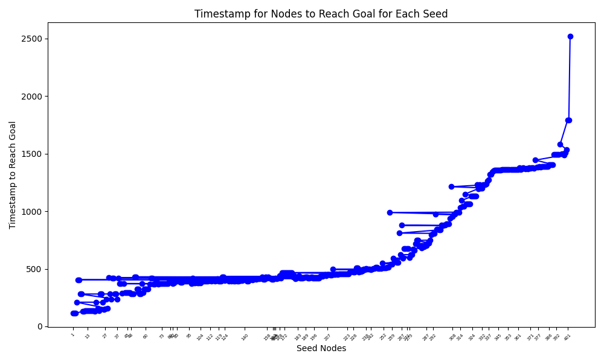

# Modelling and Data analysis in Complex systems report
## Group information
Assignment Group 1

| Name            | Student number |
|------           |----------------|
| Andrei Mereuta  | 5230527 |
| Anna Kalandadze | 5268915 |
| Marco Bak       | 5066212 |

## Assignments
For the assignment we consider edge (0, 1) and edge (1, 0) - the same edge, as it is stated that graph is undirected. Furthermore, it does not matter how often edge appears in the file - this information influence only weight, not number of edges.
For the questions A.1 - A.6 (including), when calculating number of edges,
we consider only the number of unique edges. Example: [(1, 0), (1, 0), (0, 1)] -> single unique edge.

### A.1
Number of nodes is: 403. \
Number of links is: 9565. \
Average degree is: 47.47. \
Standard deviation of the degree is: 30.14

### A.2

A scale free graph has a power law degree distribution and an ER random graph has a poisson degree distribution.
The degree distribution of our network is much more like a poisson graph.
This means that an **ER random graph** is more suitable to model our network.

### A.3
The assortative degree correlation of the graph is -0.08, which is close, but just below zero. Degree correlation shows whether nodes with similar degree correlate. 
For the graph, this means that it is mainly non-assortative, with a small tendency to be disassortative. This means that the nodes have no preference to connect to nodes with similar degree and have a small preference to connect to nodes with different degree.

### A.4
The clustering coefficient C of G is 0.2359

### A.5
Hopcount: 1.9530
Diameter: 4

### A.6
Small world graphs are defined by a high clustering coefficient, and low distances between nodes. 
The clustering coefficient is a value between 0 and 1, where a value close to one suggests a small world graph.
While the average hopcount and diameter are relatively small, which could suggest a small world property, the clustering coefficient is quite low to really suggest this.
So this graph most likely has no small world property.

### A.7

The graph is similar to power law function. To check it, we plot it on log-log scale:

We can see relatively straight line at the beginning, which then becomes more noisy and becomes horizontal. However, it looks like horizontal due to very low probabilities very close to 0. As vertical scale is quite big, the difference is not reflected in the graph. Based on two graphs, we think distribution follows power law.

### B.8

The graph looks like this, because the standard deviation is also plotted around the line displaying the average infection per timestep.

### B.9

The graph shows the timestep in which each node _i_ has infected 80% of the graph as the seed node, assuming the nodes are sorted from fastest to slowest infection rates.
Note: the graph might look a bit strange, in the sense, that some lines go to the right, then to the left. This can be explained
by example from the plot. Node-seed #42 infects 80% of the nodes, later than node-seed #70. 

### B.10: 

The blue line shows the correlation between the most infectious nodes (fastest to infect 80% of the nodes) and the nodes with the 
highest degree.
The orange line shows the correlation between the most infectious nodes (fastest to infect 80% of the nodes) and the nodes with the 
highest strength.
The degree at first grows faster than strength because infectious nodes should have many connections. 
At some point we observe that strength starts to dominate. This happens because nodes not only have many connections, 
but also these connections are distributed across time, causing higher infection rate. 

To better predict the influence of the nodes we should choose degree in cases when we do not have necessary data and we 
have to compute it (because it just uses small fraction), however in case when the data is precomputed we should choose strength metric (because the recognition rate is higher).

### B.11: 

In this exercise a third metric was added. At the start, this metric poorly performs. Possible explanation could be that
even if the node is infected at the start, it does not have many connections. However, we observe that this function grows
following parabola trajectory. The intense growth of green line begins at around 0.3 fraction, which roughly corresponds to 30% percent of all the nodes. The growing rate can be due to the fact that the more nodes we take from first contact, the higher the probability that at least some of them have early connections with different nodes, thus they will intersect with most infectious nodes.

### B.12

In first graph, we can see that recognition rate between R and R* is higher than between R and R'. 
This most probably happens due to the fact that the set of nodes which infect 10% fastly is big, thus it has higher probability to intersect with set of nodes that infect 80% fastly.

The second graph can be explained using the same logic.

The third graph shows that R' has higher recognition rate with regards to r*. We think that this may happen due to coincidence: average time to infect 80% correlates with nodes that infect 10% fastly.
