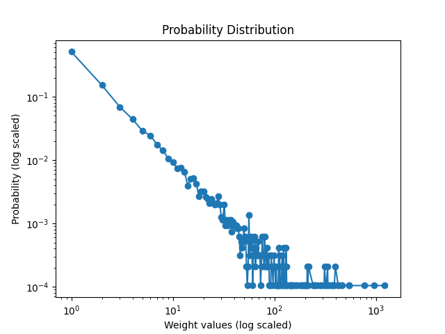

# Modelling and Data analysis in Complex systems report
## Group information
Assignment Group 1

| Name            | Student number |
|------           |----------------|
| Andrei Mereuta  | 5230527 |
| Anna Kalandadze | 5268915 |
| Marco Bak       | 5066212 |

## Assignments
For the assignment we consider edge (0, 1) and edge (1, 0) - the same edge, as it is stated that graph is undirected. Furthermore, it does not matter how often edge appears in the file - this information influence only weight, not number of edges.
### A.1
Number of nodes is: 403. \
Number of links is: 9565. \
Average degree is: 47.47. \
Standard deviation of the degree is: 30.14

### A.2

A scale free graph has a power law degree distribution and an ER random graph has a poisson degree distribution.
The degree distribution of our network is much more like a poisson graph.
This means that an **ER random graph** is more suitable to model our network.

### A.3
The assortative degree correlation of the graph is -0.08, which is close, but just below zero. Degree correlation shows whether nodes with similar degree correlate. 
For the graph, this means that it is mainly non-assortative, with a small tendency to be disassortative. This means that the nodes have no preference to connect to nodes with similar degree and have a small preference to connect to nodes with different degree.

### A.4
The clustering coefficient C of G is 0.2359

### A.5
Hopcount: 1.9530
Diameter: 4

### A.6
Small world graphs are defined by a high clustering coefficient, and low distances between nodes. 
The clustering coefficient is a value between 0 and 1, where a value close to one suggests a small world graph.
While the average hopcount and diameter are relatively small, which could suggest a small world property, the clustering coefficient is quite low to really suggest this.
So this graph most likely has no small world property.

### A.7

The graph is similar to power law function. To check it, we plot it on log-log scale:

We can see relatively straight line at the beginning, which then becomes more noisy and becomes horizontal. However, it looks like horizontal due to very low probabilities very close to 0. As vertical scale is quite big, the difference is not reflected in the graph. Based on two graphs, we think distribution follows power law.

### B.8

TODO: explain that it looks strange because a lot of error bars

### B.9

Explain graph here

### B.10: 
TODO: idk if we need to do what is stated after Attention: It is possible that many nodes have the same rank; 

TODO: Answer: Which metric, the degree or the strength could better predict the influence of the
nodes? Why?
I think there is no general answer, degree works better when has 15+% and works worse with small %.

### B.11: 
TODO: Compare this nodal property with degree and strength: which feature better/worse reflects how influential a node is and why?

