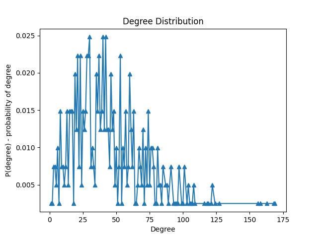
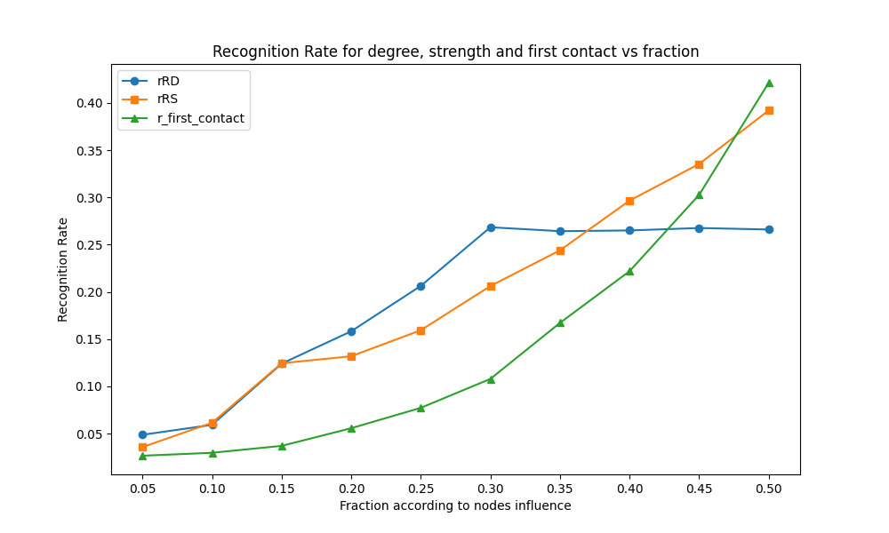
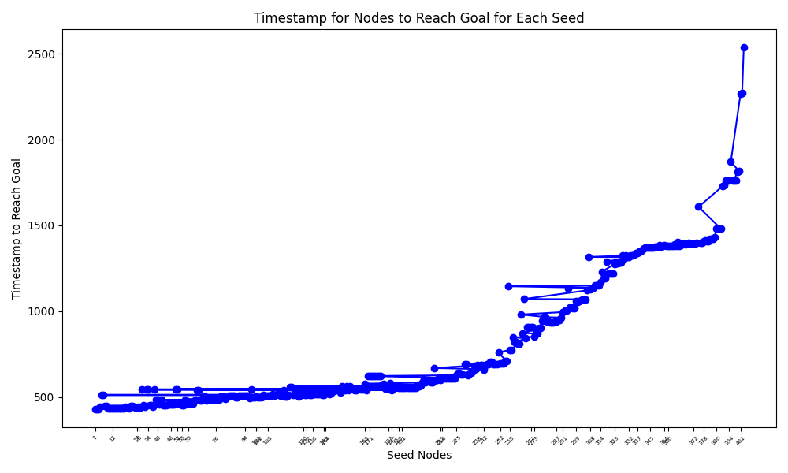
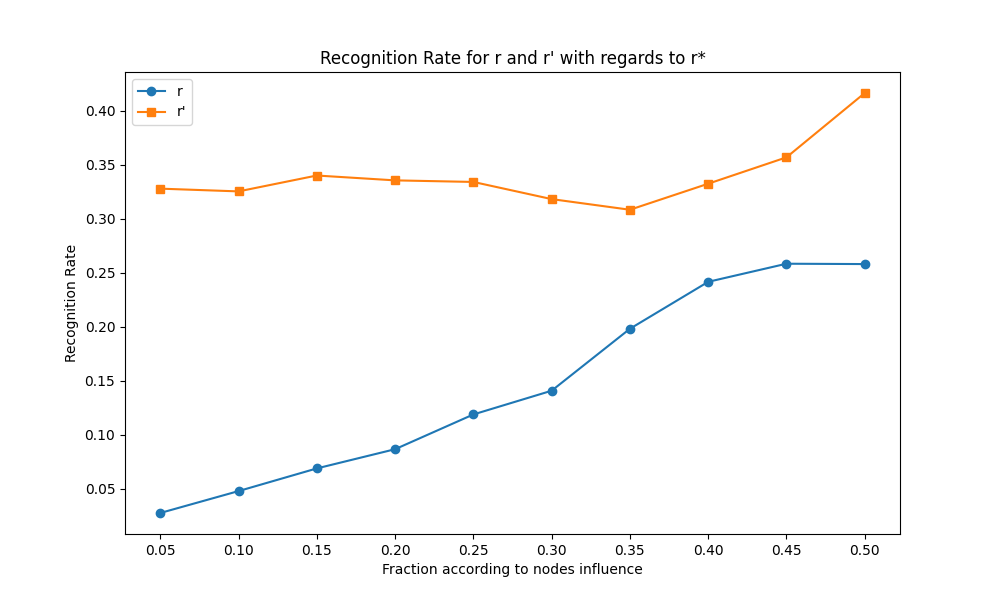

# Modelling and Data analysis in Complex systems report
## Group information
Assignment Group 1

| Name            | Student number |
|------           |----------------|
| Andrei Mereuta  | 5230527 |
| Anna Kalandadze | 5268915 |
| Marco Bak       | 5066212 |

## Assignments
For the assignment we consider edge (0, 1) and edge (1, 0) - the same edge, as it is stated that graph is undirected. Furthermore, it does not matter how often edge appears in the file - this information influence only weight, not number of edges.
For the questions A.1 - A.6 (including), when calculating number of edges,
we consider only the number of unique edges. Example: [(1, 0), (1, 0), (0, 1)] -> single unique edge.

### A.1
Number of nodes is: 403. \
Number of links is: 9565. \
Average degree is: 47.47. \
Standard deviation of the degree is: 30.14

### A.2

A scale free graph has a power law degree distribution and an ER random graph has a poisson degree distribution.
The degree distribution of our network is much more like a poisson graph.
This means that an **ER random graph** is more suitable to model our network.

### A.3
The assortative degree correlation of the graph is -0.08, which is close, but just below zero. Degree correlation shows whether nodes with similar degree correlate. 
For the graph, this means that it is mainly non-assortative, with a small tendency to be disassortative. This means that the nodes have no preference to connect to nodes with similar degree and have a small preference to connect to nodes with different degree.

### A.4
The clustering coefficient C of G is 0.2359

### A.5
Hopcount: 1.9530
Diameter: 4

### A.6
Small world graphs are defined by a high clustering coefficient, and low distances between nodes. 
The clustering coefficient is a value between 0 and 1, where a value close to one suggests a small world graph.
While the average hopcount and diameter are relatively small, which could suggest a small world property, the clustering coefficient is quite low to really suggest this.
So this graph most likely has no small world property.

### A.7

The graph is similar to power law function. To check it, we plot it on log-log scale:

We can see relatively straight line at the beginning, which then becomes more noisy and becomes horizontal. However, it looks like horizontal due to very low probabilities very close to 0. As vertical scale is quite big, the difference is not reflected in the graph. Based on two graphs, we think distribution follows power law.

### B.8

The graph looks like this, because the standard deviation is also plotted around the line displaying the average infection per timestep.

### B.9

The graph shows the timestep in which each node _i_ has infected 80% of the graph as the seed node., assuming the nodes are sorted from fastest to slowest infection rates.
Note: the graph might look a bit strange, in the sense, that some lines go to the right, then to the left. This can be explained
by example from the plot. Node-seed #42 infects 80% of the nodes, later than node-seed #70. 

### B.10: 

The recognition rate, evaluates how many of the actual influential nodes in the network are being identified by a metric like the strength or degree metrics.
This is done by comparing what percentage of the top identified nodes is actually in the top influential nodes of teh network, so the higher the .
The x-axis in the graph represents the fraction of the top influential nodes that we compare the top-influential nodes of our chosen metrics to. 

Looking at the graph provided above, we can see that up to approximately a fraction of 0.35, thee degree metric has a better recognition of influential nodes than the strength metric, and from a fraction bigger than 0.35, the degree recognition does not improve anymore, while the strength metric keeps improving on the recognition. A reason that the degree metric performance stays the same, can be that when the fraction becomes to big, more and more nodes have the same degree, as we can see in picture of A.2. This means that the metric sees these as equally influential, while in reality that does not have to be the case.

To find influential nodes fairly easily, the degree metric seems to be the best. This is mainly because it performs best on smaller fractions. Working with smaller fractions can significantly improve the computation time.

### B.11: 

In this exercise a third metric was added. This metric, determines the influence of a node based on when has contact with the information. This metric improves in performance, the bigger the fraction becomes. only from a fraction bigger than 0.4 to 0.45 it starts to really perform better than the two other metrics.

### B.12

When comparing R, R* and R'to each other, We can see that R has a worse recognition rate than both R* an R'. Next tot that we also see that R* outperforms R'.

 (Basic Idea, small portion, less influential nodes have harder time to get to 10% than more influential, so at the start bigger time difference.
 For fraction 70% of all nodes, the more influential nodes probably get included at some point, speeding up infection rates of less influential nodes as well, this can make that average times to reach 80% are closer to each other than times to reach 10%, making 10% a better metric. Figure of B9 shows that for the most nodes the time to reach 80% are really similar for most nodes.)

We can explain this by a similar reasoning as used in B.10.
The biggest difference between R* and R'and R is that R* only checks how fast 10% of all the nodes are infected. R and R' check when 80% are used of the are reached.
By checking a smaller portion, the time difference of the more influential nodes to reach the wanted amount of nodes is probably bigger than when the fraction is higher. Especially  considering that the average hop count is approximately 2.
With this small hop count, the time to reach a big fraction of all the nodes, will most likely become really similar. 
This is because when you have already covered a bigger part of the network, each timestep will infect a way bigger group than before because the graph is closely connected.
While for R*, where we check the time for only 10% to be infected, nodes that have many nodes within close reach perform way better early on than nodes with less nodes close by. 
